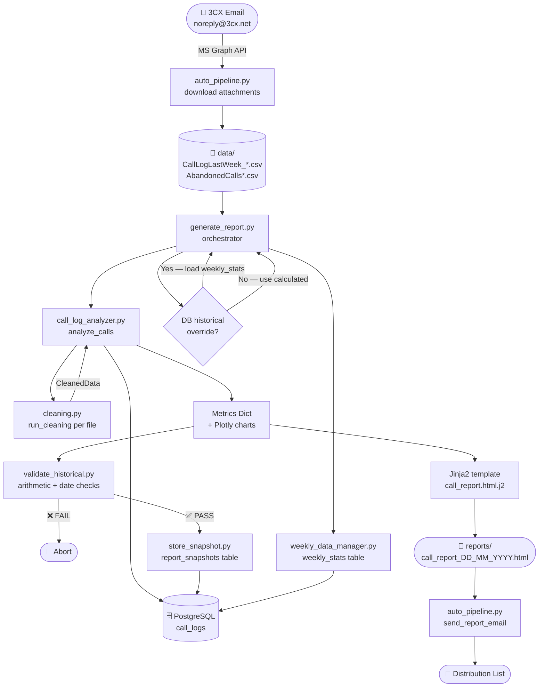
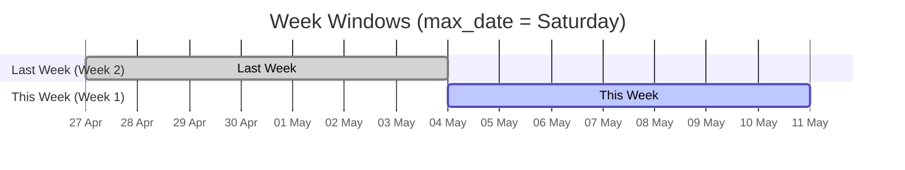
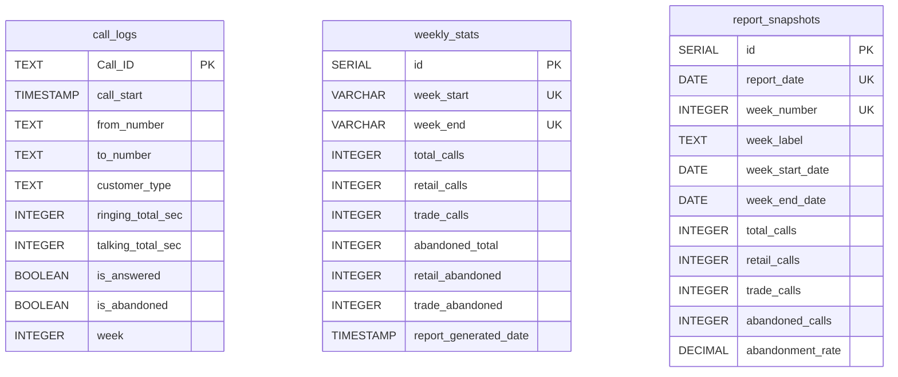

# Southside / Omni Call Center Analytics

A data pipeline that ingests raw 3CX call-log CSVs, calculates week-over-week
metrics (Retail vs Trade vs Abandoned), generates interactive HTML reports with
Plotly charts, and stores snapshots to PostgreSQL for trend tracking.

---

## Pipeline Overview



---

## Week Logic

Each report covers **two 7-day windows** pinned to the latest date in the data files (called `max_date`).



| Label | Date range | Metric prefix |
|---|---|---|
| **This Week** | `max_date - 6 days` → `max_date` | `week1_*` |
| **Last Week** | `max_date - 13 days` → `max_date - 7 days` | `week2_*` |

> **Historical consistency:** When Last Week's figures are available from a
> previous run they are loaded from the `weekly_stats` table and used instead
> of recalculating, so the same calendar week always shows the same numbers
> across consecutive reports.

---

## Database Schema



**Connection:** `kmc.tequila-ai.com:5432 / tequila_ai_reporting` (credentials in `.env`).

---

## File Map

| File | Role |
|---|---|
| `auto_pipeline.py` | End-to-end orchestrator (email → generate → send) |
| `generate_report.py` | Report orchestrator — ties together all stages |
| `call_log_analyzer.py` | Core analysis engine, chart generation, DB upsert |
| `cleaning.py` | Per-file CSV parsing, leg → call aggregation |
| `validate_historical.py` | Arithmetic + date-range + historical consistency checks |
| `store_snapshot.py` | Writes to `report_snapshots` table |
| `weekly_data_manager.py` | Reads/writes `weekly_stats` table |
| `db.py` | Shared PostgreSQL connection factory |
| `cleanup_data.py` | Archives processed raw files to `archive/` |
| `backfill_data.py` | Seeds `weekly_stats` from existing HTML reports |
| `templates/call_report.html.j2` | Jinja2 HTML report template |

---

## Installation

Requires Python 3.10+.

```bash
git clone <repo-url>
pip install -r requirements.txt
cp .env.example .env   # then fill in credentials
```

---

## Usage

### Normal weekly run

```bash
python generate_report.py
```

### Back-filling a missing week

Pass the **Saturday** that ended the missing week:

```bash
python generate_report.py --date 2026-05-10
```

This caps the data at that date and generates the report as if you had run it
that week.

> **If a previous bad run wrote incorrect data to the DB** (e.g. a "1-call"
> record), the historical override will load those bad numbers instead of
> recalculating.  Delete the stale rows first:
>
> ```sql
> DELETE FROM weekly_stats    WHERE week_start = '2026-05-04' AND total_calls < 100;
> DELETE FROM report_snapshots WHERE report_date = '2026-05-10';
> ```
>
> Then re-run with `--date` and the pipeline recalculates from raw CSVs.

### Full automated pipeline (email → report → send)

```bash
python auto_pipeline.py
```

Schedule this via Windows Task Scheduler for Tuesday mornings.

---

## Outputs

All outputs land in `reports/`:

| File | Description |
|---|---|
| `call_report_DD_MM_YYYY.html` | Main dashboard (shareable) |
| `report_verification_summary.md` | Audit log proving arithmetic is correct |
| `call_logs_cleaned.csv` | Deduplicated call-level data |
| `abandoned_logs_cleaned.csv` | Classified abandoned calls |

---

## Environment Variables

See `.env.example` for the full list.  Key variables:

```ini
DB_HOST=kmc.tequila-ai.com
DB_PORT=5432
DB_NAME=tequila_ai_reporting
DB_USER=james
DB_PASSWORD=<password>
DB_SSLMODE=require

AZURE_TENANT_ID=<tenant>
AZURE_CLIENT_ID=<client>
AZURE_CLIENT_SECRET=<secret>
MS_USER_EMAIL=smf_ingestion@tequila-ai.com
DATA_SOURCE_EMAIL=noreply@3cx.net
REPORT_RECIPIENTS=recipient@example.com
```

---

## Key Features

- **Historical consistency** — Last Week figures are always loaded from the
  DB if available, so the same calendar week never shows different numbers in
  two consecutive reports.
- **Idempotent DB writes** — All three tables use `ON CONFLICT … DO UPDATE`,
  so re-running the pipeline is always safe.
- **Back-fill support** — `--date` flag caps data to any historical Saturday
  for recovering a missed week.
- **Arithmetic validation** — Report generation aborts with a clear error if
  `Retail + Trade + Abandoned ≠ Total` for either week.
- **Customer classification** — Retail vs Trade is inferred from the call
  activity details (digit → retail, name → trade).  Abandoned calls are
  reclassified by matching Caller ID against known trade numbers.
