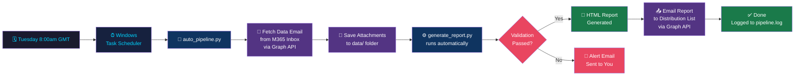
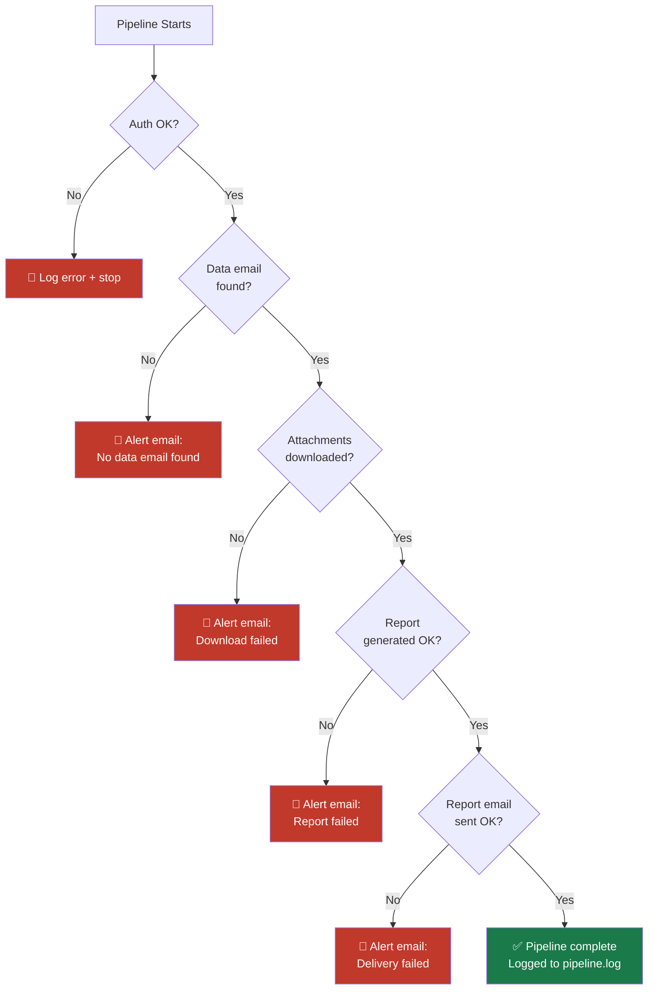

# Weekly Call Log Report — Automation Plan

## Overview

This document outlines the plan to fully automate the weekly call log reporting workflow — from receiving the source data email, running the report, through to delivering it to stakeholders — with zero manual steps.

---

## Current vs Automated Workflow

| Step | Current (Manual) | Automated |
|---|---|---|
| Receive data email | ✅ Arrives automatically | ✅ Arrives automatically |
| Download attachments | ❌ Manual download | ✅ Script fetches via Graph API |
| Move files to `data/` | ❌ Manual | ✅ Script saves directly |
| Run `generate_report.py` | ❌ Manual | ✅ Called automatically |
| Email report to stakeholders | ❌ Manual | ✅ Script sends via Graph API |
| Error alerts | ❌ None | ✅ Alert email sent to you |
| Audit log | ❌ None | ✅ Written to `pipeline.log` |

---

## End-to-End Automated Pipeline




---

## Schedule

```mermaid
gantt
    title Weekly Automation Timeline
    dateFormat  HH:mm
    axisFormat  %H:%M

    section Monday Night
    Data email arrives from source    :milestone, 23:00, 0m

    section Tuesday Morning
    Task Scheduler triggers pipeline  :active, 08:00, 5m
    Fetch email + download files      :08:00, 2m
    Generate report                   :08:02, 5m
    Email report to stakeholders      :08:07, 1m
    Done — stakeholders receive report :milestone, 08:08, 0m
```



---

## Components

### `auto_pipeline.py` (already built ✅)

The main script handles the full pipeline end-to-end:

```
auto_pipeline.py
├── get_access_token()          — Authenticate with Microsoft Graph API
├── fetch_data_attachments()    — Find email, download CSVs to data/
├── run_report()                — Call generate_report.py
├── send_report_email()         — Email HTML report to distribution list
├── send_alert_email()          — Alert you if anything goes wrong
└── run_pipeline()              — Orchestrates all of the above
```

### Error Handling Flow



---

## Setup Guide

### Step 1 — Azure App Registration


This is a one-time setup that gives the script secure access to your M365 mailbox.

1. Go to [portal.azure.com](https://portal.azure.com) and sign in with your Trillium Capital M365 account
2. Navigate to **Azure Active Directory** → **App registrations** → **New registration**
3. Name it: `Call Log Report Automation` → click **Register**
4. From the app's **Overview** page, copy:
   - **Application (client) ID**
   - **Directory (tenant) ID**
5. Go to **API permissions** → **Add a permission** → **Microsoft Graph** → **Application permissions**
   - Add `Mail.Read`
   - Add `Mail.Send`
6. Click **Grant admin consent for [your organisation]**
7. Go to **Certificates & secrets** → **New client secret** → set expiry → copy the **Value**

> [!IMPORTANT]
> If Trillium Capital has an IT department managing Azure AD, you will need to ask them to grant admin consent in Step 6. This is a standard, routine request — just share this document with them.

> [!CAUTION]
> The client secret value is only shown once. Copy it immediately and store it securely in your `.env` file.

---

### Step 2 — Update `.env` File

Add these 6 variables to your existing `.env` file (alongside your existing DB credentials):

```env
# Microsoft Graph API — Call Log Automation
AZURE_TENANT_ID=xxxxxxxx-xxxx-xxxx-xxxx-xxxxxxxxxxxx
AZURE_CLIENT_ID=xxxxxxxx-xxxx-xxxx-xxxx-xxxxxxxxxxxx
AZURE_CLIENT_SECRET=your-client-secret-value-here
MS_USER_EMAIL=your.name@trilliumcapital.com

# Pipeline config
DATA_SOURCE_EMAIL=sender@data-source.com
REPORT_RECIPIENTS=person1@example.com,person2@example.com,person3@example.com
```

---

### Step 3 — Test the Script Manually

Before scheduling, run it once manually to verify everything works:

```powershell
cd "C:\Users\irish\OneDrive - Trillium Capital Ltd\Documents\GitHub\call_log_analysis"
python auto_pipeline.py
```

Check `pipeline.log` for a detailed record of what happened.

---

### Step 4 — Windows Task Scheduler

Set up a scheduled task to run the pipeline automatically every Tuesday at 8am.

**Option A — Using the GUI:**
1. Open **Task Scheduler** (search in Start menu)
2. Click **Create Basic Task** → Name: `Call Log Report Pipeline`
3. Trigger: **Weekly** → **Tuesday** → Start time: `08:00:00`
4. Action: **Start a program**
   - Program: `python`
   - Arguments: `auto_pipeline.py`
   - Start in: `C:\Users\irish\OneDrive - Trillium Capital Ltd\Documents\GitHub\call_log_analysis`
5. ✅ Check **Run whether user is logged in or not**
6. ✅ Check **Run with highest privileges**

**Option B — I can generate a ready-to-import `.xml` file** for Task Scheduler — just ask.

---

## File Structure After Setup

```
call_log_analysis/
├── auto_pipeline.py        ← New: full automation script
├── generate_report.py      ← Existing: called automatically by pipeline
├── store_snapshot.py       ← Existing: called by generate_report.py
├── weekly_data_manager.py  ← Existing: database management
├── pipeline.log            ← New: created on first run, audit trail
├── .env                    ← Updated: add the 6 new Graph API variables
└── data/
    └── *.csv               ← Auto-populated each Tuesday by the pipeline
```

---

## Open Questions

> [!IMPORTANT]
> Before we go live, please confirm:
> 1. **IT-managed Azure AD?** — Do you need IT admin to grant consent in Step 1?
> 2. **Data source email** — What is the exact sender address the data files come from?
> 3. **Distribution list** — Please provide the recipient email addresses for `REPORT_RECIPIENTS`
> 4. **Your M365 email** — Confirm the exact address for `MS_USER_EMAIL`
> 5. **Task Scheduler XML** — Would you like me to generate the ready-to-import XML file?
