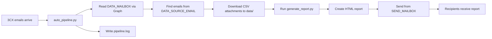

# Weekly Call Log Report - Automation Plan

## Overview

This document describes the working automation setup for the weekly call log report. The goal is to remove the manual steps of downloading the 3CX CSV attachments, moving them into `data/`, running the report, and emailing the finished HTML report.

The current `auto_pipeline.py` has been tested manually and can:

1. Authenticate to Microsoft Graph.
2. Read the mailbox where 3CX sends the report files.
3. Download the CSV attachments into `data/`.
4. Run `generate_report.py`.
5. Send the generated HTML report by email.
6. Write an audit trail to `pipeline.log`.

## Confirmed Email Roles

The pipeline now separates the three email roles clearly:

```env
DATA_MAILBOX=smf_ingestion@tequila-ai.com
SEND_MAILBOX=james@tequila-ai.com
DATA_SOURCE_EMAIL=noreply@3cx.net
REPORT_RECIPIENTS=james@trillium.ie
```

`DATA_MAILBOX` is the mailbox the script checks for incoming 3CX data emails.

`SEND_MAILBOX` is the mailbox the script uses to send the finished report.

`DATA_SOURCE_EMAIL` is the sender address on the incoming 3CX emails.

`REPORT_RECIPIENTS` is the list of people who receive the generated report.

In testing, the incoming 3CX emails were:

- From: `noreply@3cx.net`
- To: `smf_ingestion@tequila-ai.com`
- Subject: `3CX: Your Scheduled Reports are ready`
- Attachments: one CSV per email, across several emails

The final report email was successfully sent from:

- From: `james@tequila-ai.com`
- To: `james@trillium.ie`

## Recommended Hosting Option

The preferred option is to run this on the company server using Windows Task Scheduler.

This is better than running it on a personal PC because the server is more likely to be on, connected, backed up, and managed consistently. It also keeps the report data and credentials inside company infrastructure.

Ask IT whether the server can run a weekly Python scheduled task with:

- Python installed.
- A local copy of this GitHub repository.
- Dependencies installed from `requirements.txt`.
- Outbound HTTPS access to Microsoft Graph.
- Access to the reporting database, if required by the report pipeline.
- A local `.env` file containing Microsoft Graph and database credentials.
- Windows Task Scheduler configured to run `python auto_pipeline.py`.

## Alternative Options

### Option 1 - Company Server

Recommended.

Pros:

- Most reliable operational setup.
- Keeps sensitive call data on company infrastructure.
- Works with the current Python script.
- Can use a local `.env` file that is not committed to Git.
- Easy to schedule with Windows Task Scheduler.

Cons:

- Requires IT/server access.
- Server must have Python and the required network/database access.

### Option 2 - Personal PC

Good for short-term testing only.

Pros:

- Fastest to set up.
- Already proven manually.
- No GitHub Actions or server setup needed.

Cons:

- Only runs if the PC is on, awake, online, and logged/configured correctly.
- OneDrive paths can cause occasional file lock or sync issues.
- Not ideal for production reporting.

### Option 3 - GitHub Actions

Possible, but not the first choice.

Pros:

- Can run on a weekly schedule without a local machine.
- Logs are available in GitHub.
- No server scheduling needed.

Cons:

- Call data and report outputs may contain sensitive customer/call information.
- Microsoft Graph secrets and database credentials would need to be stored as GitHub Actions secrets.
- GitHub runners may not be able to reach the reporting database if it is private or IP-restricted.
- Generated `data/` and `reports/` files would need a clear storage plan: email only, artifact upload, or commit back to the repo.
- GitHub scheduled workflows can be delayed.

Use GitHub Actions only if IT confirms the data/security position is acceptable and the database/network requirements can be met.

## Current Pipeline



## `.env` Configuration

The Microsoft Graph and pipeline settings should be stored locally in `.env`.

Do not commit `.env` to Git.

```env
# Microsoft Graph API - Call Log Automation
AZURE_TENANT_ID=xxxxxxxx-xxxx-xxxx-xxxx-xxxxxxxxxxxx
AZURE_CLIENT_ID=xxxxxxxx-xxxx-xxxx-xxxx-xxxxxxxxxxxx
AZURE_CLIENT_SECRET=your-client-secret-value-here

# Mailbox roles
DATA_MAILBOX=smf_ingestion@tequila-ai.com
SEND_MAILBOX=james@tequila-ai.com
DATA_SOURCE_EMAIL=noreply@3cx.net
REPORT_RECIPIENTS=james@trillium.ie

# Legacy fallback used by older script versions
MS_USER_EMAIL=smf_ingestion@tequila-ai.com
```

Important: `AZURE_CLIENT_SECRET` must be the client secret **Value**, not the Secret ID.

## Microsoft Graph Permissions

The Entra app registration is named:

```text
Call Log Report Automation
```

Required Microsoft Graph application permissions:

- `Mail.Read`
- `Mail.Send`

These are application permissions because the job runs unattended.

Security recommendation for IT: restrict the application to only the mailboxes it needs:

- `smf_ingestion@tequila-ai.com` for reading incoming data emails.
- `james@tequila-ai.com` for sending report emails.

If IT cannot scope permissions exactly this way, they should confirm the acceptable security model before the automation is scheduled.

## Server Setup Checklist for IT

1. Choose the server where the scheduled job should run.
2. Install Python 3.11+ or confirm an existing compatible Python installation.
3. Clone or copy this repository to the server.
4. Create a virtual environment.
5. Install dependencies:

```powershell
pip install -r requirements.txt
```

6. Create a local `.env` file with the Graph, mailbox, recipient, and database settings.
7. Run a manual test:

```powershell
python auto_pipeline.py
```

8. Confirm `pipeline.log` shows:

```text
PIPELINE COMPLETED SUCCESSFULLY
```

9. Confirm the report email is received.
10. Create a weekly Windows Task Scheduler task.

## Suggested Schedule

The 3CX emails currently arrive on Monday evening around 22:00 UTC.

Recommended scheduled run:

```text
Tuesday 08:00 local time
```

This gives the source emails time to arrive before the report job starts.

## Windows Task Scheduler Settings

Suggested task:

```text
Name: Call Log Report Pipeline
Trigger: Weekly, Tuesday, 08:00
Action: Start a program
Program: python
Arguments: auto_pipeline.py
Start in: <server path to call_log_analysis repo>
```

Recommended options:

- Run whether user is logged on or not.
- Run with highest privileges if required by the server policy.
- Configure the task to retry if it fails.
- Keep task history enabled.

## Current Known Issue

The script successfully reads and downloads attachments, but Microsoft Graph returned `ErrorAccessDenied` when trying to mark the 3CX emails as read.

This is not blocking the report because downloaded files with the same filenames are overwritten. However, because the messages stay unread, the script may reprocess the same emails on later runs.

Recommended hardening before final production scheduling:

- Add a local processed-message log, for example `processed_messages.json`.
- Store each processed Graph message ID.
- Skip message IDs that have already been processed.
- Keep overwriting same-name attachment files in `data/`, but avoid repeatedly downloading old emails.

This avoids asking IT for broader write permission such as `Mail.ReadWrite`.

## File Overwrite Behavior

When the same email attachments are read again, the script saves them to the same path in `data/`.

Current behavior:

```text
Same filename -> overwritten
Different filename -> added as another file
```

Because 3CX filenames include dates and random suffixes, old historical files can accumulate in `data/`. This matches the existing report pipeline, which reads historical files from `data/`.

If the same weekly data is resent with a new random filename, the pipeline may treat it as an additional source file unless the report-level deduplication handles the records. The processed-message log is the cleaner prevention.

## Validation Commands

Run these after code changes or server setup:

```powershell
python auto_pipeline.py
python diagnose_mailbox.py
python diagnose_sent_mail.py
python sanity/verify_data_integrity.py
python sanity/test_core_logic.py
python sanity/verify_metrics.py
```

For syntax without writing OneDrive `__pycache__` files:

```powershell
python - <<'PY'
from pathlib import Path
for file_name in ["auto_pipeline.py", "diagnose_mailbox.py", "diagnose_sent_mail.py"]:
    compile(Path(file_name).read_text(encoding="utf-8"), file_name, "exec")
print("syntax ok")
PY
```

## Questions for IT

Send IT these questions:

```text
Can we run a weekly Python scheduled task on the company server for the call log report automation?

It needs:
- Python installed.
- Access to this GitHub repo or a local copy of it.
- Outbound HTTPS access to Microsoft Graph.
- Access to the reporting database, if the report uses one.
- A local .env file containing Microsoft Graph and DB credentials.
- Windows Task Scheduler weekly run, ideally Tuesday morning after the 3CX emails arrive.

The script reads 3CX CSV attachments from:
smf_ingestion@tequila-ai.com

The incoming data emails come from:
noreply@3cx.net

The script sends the final report from:
james@tequila-ai.com

The report is currently sent to:
james@trillium.ie

Please confirm whether the Microsoft Graph app can be restricted to only the required read/send mailboxes.
```
